# Animated Garage

A simple animation of a garage door opening and closing.

Designed by LilTrublMakr

## Preview

| Opening | Open | Closing | Closed |
| --- | --- | --- | --- |
|  |  |  |  |

## /button_card_templates/base.yaml

Find line: `state_on: >
      [[[ return ['on', 'home', 'cool', 'fan_only', 'playing', 'unlocked'].indexOf(!entity || entity.state) !== -1; ]]]`

Add `open` to the list: `...'unlocked', 'open'].indexOf...`

## /button_card_templates/icons.yaml

```yaml
icon_garage:
  styles:
    custom_fields:
      icon:
        - width: 100%
        - margin-left: -5%
        - margin-top: -15%
        - fill: >
            [[[ return variables.state_on ? '#4b5254' : '#9da0a2'; ]]]
  custom_fields:
    icon: >
      [[[
        let style = `
          <style>
            @keyframes opening {
              0% { opacity: 1; }
              100% { opacity: 0; }              
            }
            .garage-bottom-opening {
              animation: opening 0.66s ease;
              animation-fill-mode: forwards;
            }
            .garage-mid-opening {
              animation: opening 0.66s ease;
              animation-delay: 0.66s;
              animation-fill-mode: forwards;
            }
            .garage-top-opening {
              animation: opening 0.66s ease;
              animation-delay: 1.32s;
              animation-fill-mode: forwards;
            }
            @keyframes closing {
              0% { opacity: 0; }
              100% { opacity: 1; }              
            }
            .garage-bottom-closing {
              opacity: 0;
              animation: closing 0.66s ease;
              animation-delay: 1.32s;
              animation-fill-mode: forwards;
            }
            .garage-mid-closing {
              opacity: 0;
              animation: closing 0.66s ease;
              animation-delay: 0.66s;
              animation-fill-mode: forwards;
            }
            .garage-top-closing {
              opacity: 0;
              animation: closing 0.66s ease;
              animation-fill-mode: forwards;
            }
          </style>
        `;
        if (variables.state_on && variables.timeout < 2000) {
            return `
              <svg viewBox="0 0 24 24">
                ${style}
                <polyline class="garage-house" points="22,9 22,20 20,20 20,11 4,11 4,20 2,20 2,9 12,5 22,9 "/>
                <rect class="garage-top-opening" x="5" y="12" width="14" height="2"/>
                <rect class="garage-mid-opening" x="5" y="15" width="14" height="2"/>
                <rect class="garage-bottom-opening" x="5" y="18" width="14" height="2"/>
              </svg>
            `;
        }
        if (variables.state_on && variables.timeout > 2000) {
            return `
              <svg viewBox="0 0 24 24">
                <polyline class="garage-house" points="22,9 22,20 20,20 20,11 4,11 4,20 2,20 2,9 12,5 22,9 "/>
              </svg>
            `;
        }
        if (variables.state === 'closed' && variables.timeout < 2000) {
            return `
              <svg viewBox="0 0 24 24">
                ${style}
                <polyline class="garage-house" points="22,9 22,20 20,20 20,11 4,11 4,20 2,20 2,9 12,5 22,9 "/>
                <rect class="garage-top-closing" x="5" y="12" width="14" height="2"/>
                <rect class="garage-mid-closing" x="5" y="15" width="14" height="2"/>
                <rect class="garage-bottom-closing" x="5" y="18" width="14" height="2"/>
              </svg>
            `;
        } else {
            return `
              <svg viewBox="0 0 24 24">
                <polyline class="garage-house" points="22,9 22,20 20,20 20,11 4,11 4,20 2,20 2,9 12,5 22,9 "/>
                <rect x="5" y="12" width="14" height="2"/>
                <rect x="5" y="15" width="14" height="2"/>
                <rect x="5" y="18" width="14" height="2"/>
              </svg>
            `;
        }
      ]]]
```